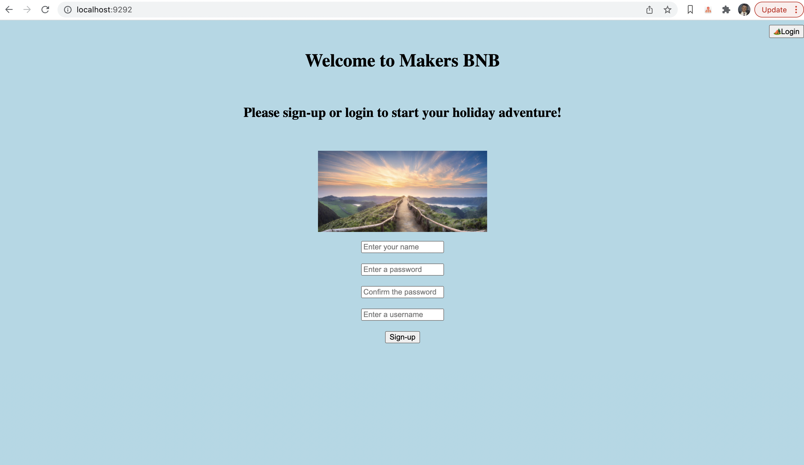

<!-- A high level description of the project specification.
A user stories section (leave it blank for now). -->

## Makersbnb specification:

This project is a creation of a web application that allows users to list spaces they have available and to hire out these spaces.  
Following functionality included in the website.:

* Ability for the user to set up an account.
* Sign in and llist spaces as a user.
* Ability to request spaces for hire.
* Ability to confirm these requests when applied to the user's space.
* Ability to list what spaces have been requested and confirmed.

## Programming languages and framework used.:

* Ruby 3.0.0
* postgresSQL
* Sinatra
* html:  includes CSS and JavaScript
* rpsec
* rack

## Run following in terminal upon initial creation of program.:
* `git clone https://github.com/Jaroslaw-Roman-Cudzich/Makersbnb.git`
* `cd Makersbnb`
* `bundle install`
* `rackup`


## Instructions for 'makersbnb_manager' database, 'users' table, and 'spaces' table creation within psql.:

1. Connect to psql
2. Create the database using the psql command CREATE DATABASE makersbnb_manager;
3. Connect to the database using the pqsl command \c makersbnb_manager;
4. Run the query we have saved in the file 01_CREATE_USERS_TABLES.SQL
5. Run the query we have saved in the file 02_CREATE_SPACES_TABLES.SQL


## Instructions for 'makersbnb_manager_test' database, 'users' table, and 'spaces' table creation within psql.:

1. Connect to psql
2. Create the database using the psql command CREATE DATABASE makersbnb_manager_test;
3. Connect to the database using the pqsl command \c makersbnb_manager_test;
4. Run the query we have saved in the file db/migrations/01_CREATE_USERS_TABLES.SQL
5. Run the query we have saved in the file db/migrations/02_CREATE_SPACES_TABLES.SQL

````
````


## MVC Model of Makerbnb website code:


## Screen shot of home page:




## User Stories:
````

As a user
To gain access to the website's letting/renting features
I would like to sign up for the website

As a host_user
To show what spaces I have for let
I would like to add my space to a list of space(s)

As a host_user
To show what spaces I have for let
I would like to display multiple space(s) on the website

As a host_user
To keep track of each space
I would like to name the space

As a host_user
To know what my space contains
I would like a description of the space

As a host_user
To be able to let out my space
I would like to set a price per space

As a host_user
To be able to let out my space
I would like to show the dates that the space is available

As a tenant_user 
To be able to hire a space
I would be able to request to hire the space

As a host_user
When the tenant_user requests the use of the space
I would like to approve the request

As a host_user
So that I can remove the dates from the availability
I would like to confirm the tenant_user request

As a host_user
So that I can choose the best tenant_user
I would like this space to be availabe until the request is confirmed

As a tenant_user
So that I don't book a space that is not available
I would like to only see the available dates for that space

````


